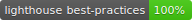

# Meteo

Meteo is a simple, minimalist weather application built with Webpack, Stylus and React.

The App provides a 5 day weather forecast using [Openweathermaps 5 day weather API](https://openweathermap.org/forecast5) and Google places to parse Latitude and Longitude for the location search.

It's currently deployed on Netlify [here](https://distracted-wright-bee694.netlify.com/).

## Requirements

- The api requests for weather forecasts requires an [Openweathermaps Api key](https://openweathermap.org).

- The location search requires a Google Api Key with Places, Geolocation and Geodecoder enabled.

Check out the `.env.example` file to see what needs to be added.

## Installation

- Clone The Repo

- Copy `.env.example` to `.env` and fill in the required keys as per the requirements section.

- Ensure a working version of node is installed.

- run `npm install` to install required dependencies.

- run `npm run dev` to spin up a development server at http://localhost:7777.

- run `npm run build` to build the project to the `dist` directory

- run `npm run start` to build the project and start a production server at http://localhost:5000

## Testing

- `npm run test` runs unit tests provided by [Jest](https://jestjs.io/) and [React Testing Library](https://testing-library.com/docs/react-testing-library/intro)

- `npm run test:integration` builds the application, starts a production server and runs integration tests provided by [Cypress](https://www.cypress.io/)

## Features

- Search for a 5 day weather forecast by location.

- Theme changes based on sunrise and sunset times of chosen location.

- Timelines in 3 hour intervals for each day and graphs showing humidity, rainfall, temperature and windspeed.

- Location is stored via local storage and persists on page refresh.

- Uses PWA features to cache for offline usage!

## License

MIT, Open Source, just credit the author if you plan to expand on the project.
